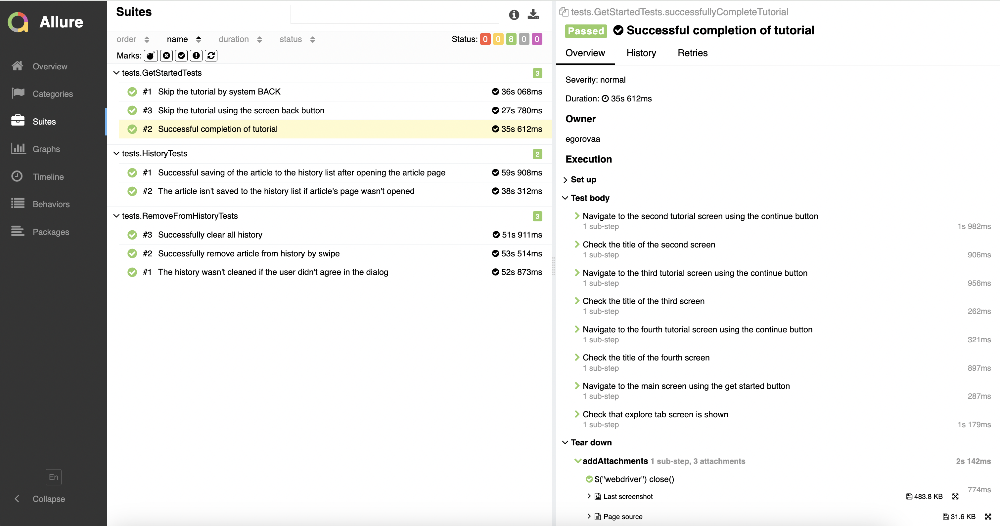
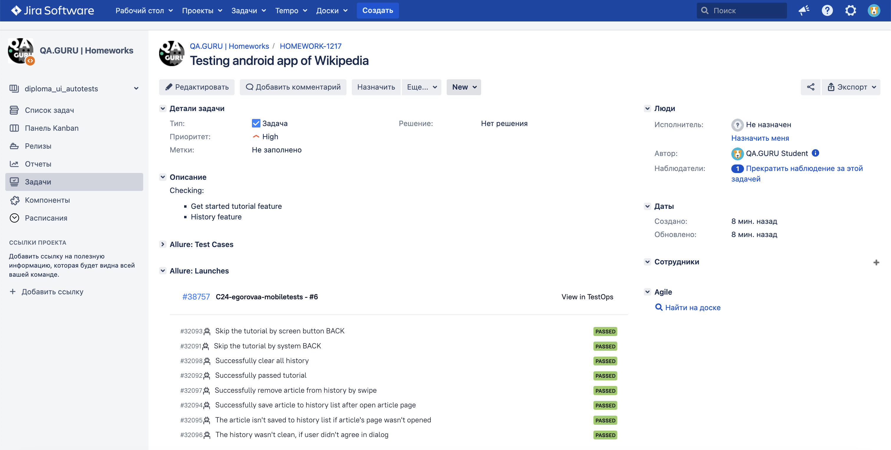

# Android Test Automation Project for [Wikipedia](https://www.wikipedia.org/)
<p align="center">
  
</p>

## **Contents:** ##

* <a href="#tools">Technologies and tools</a>

* <a href="#cases">Examples of automated test cases</a>

* <a href="#jenkins">Build in Jenkins</a>

* <a href="#console">Run from Terminal</a>

* <a href="#allure">Allure report</a>

* <a href="#testops">Integration with Allure TestOps</a>

* <a href="#jira">Integration with Jira</a>

* <a href="#telegram">Telegram notification with bot</a>

* <a href="#video">Test execution video examples</a>


---------
<a id="tools"></a>
## <a name="Technologies and tools">**Technologies and tools:**</a>

<p align="center">
<a href="https://www.w3schools.com/java/">  </a> 
<a href="https://www.jetbrains.com/idea/">  </a> 
<a href="https://www.android.com/">  </a> 
<a href="https://developer.android.com/studio">  </a> 
<a href="https://git-scm.com/">  </a> 
<a href="https://junit.org/junit5">  </a>
<a href="https://rest-assured.io/">  </a>
<a href="https://selenide.org">  </a>
<a href="https://www.browserstack.com/">  </a>
<a href="https://appium.io/">  </a>
<a href="https://gradle.org">  </a>
<a href="https://allurereport.org/">  </a>
<a href="https://qameta.io/">  </a>
<a href="https://www.jenkins.io">  </a>
<a href="https://www.atlassian.com/software/jira">  </a>
</p>

- The mobile autotests were written in **Java** for **Android** application.
- **Gradle** was used as the builder.
- **JUnit 5**, **Appium** and **Selenide** frameworks were used as test frameworks.
- **UIAutomator2** was used as an Android driver.
- Tests could run on a real device, emulator and had integration with the **Browserstack** cloud mobile testing platform.
- **Rest-assured** was used for interaction with the Browserstack API.
- For remote run, a job in **Jenkins** with **Allure report** generation and result sending to **Telegram** using a bot has been implemented.
- Integration with **Allure TestOps** and **Jira** has been established.

------
<a id="cases"></a>
## **Examples of automated test cases:**
**Get started tutorial**
- ✅ Skip the tutorial by system BACK  
- ✅ Skip the tutorial by screen button BACK  
- ✅ Successfully passed tutorial

**History feature**
- ✅ Successfully save article to history list after opening the article page 
- ✅ Checking that the article isn't saved to the history list if the article's page wasn't opened
- ✅ Successfully remove article from history by swipe
- ✅ Successfully clear all history
- ✅ Checking that the history wasn't cleared, if the user didn't agree in the dialog

----
<a id="jenkins"></a>
## Build in Jenkins ([link](https://jenkins.autotests.cloud/job/C24-egorovaa-mobiletests/))
<p align="center">  
<a href="https://jenkins.autotests.cloud/job/C24-egorovaa-mobiletests//"></a>  
</p>

### **Jenkins build options:**

- `USER_NAME` 
- `ACCESS_KEY`
- `COMMENT` (default - Android wiki api test results)

----
<a id="console"></a>
## Run from Terminal

**Local launch with Browserstack**
```bash
clean test
-DdeviceHost=browserstack
-DuserName={userName from you browserstack account}
-DaccessKey={accessKey from you browserstack account}
-DdeviceName=Samsung Galaxy M52
-DplatformVersion=11.0
```
more information about Browserstack account and credentials [here](https://app-automate.browserstack.com/dashboard/v2/quick-start/setup-browserstack-sdk)

**Local launch on emulator or real(local) device**
```bash
clean test
-DdeviceHost=emulator/local
-Dudid=emulator-5554/EFJNFDC3S22
```
Appium Server and Uiautomator2 must be installed and configred before launching tests.
After that, run the Appium Server with the command:

`appium server --base-path /wd/hub`   

**Remote launch via Jenkins (only with Browserstack)**
```bash
clean test
-DuserName=${USER_NAME}
-DaccessKey=${ACCESS_KEY}
-Dcomment=${COMMENT}
```

----
<a id="allure"></a>
## Allure report ([link](https://jenkins.autotests.cloud/job/C24-egorovaa-mobiletests/allure/))

**Main report page**
<p align="center">  
<a href="https://jenkins.autotests.cloud/job/C24-egorovaa-mobiletests/allure/"></a>  
</p>

**Test cases**
<p align="center">  
<a href="https://jenkins.autotests.cloud/job/C24-egorovaa-mobiletests/allure/"></a>  
</p>


----
<a id="testops"></a>
## Integration with Allure TestOps ([link](https://allure.autotests.cloud/project/4222/dashboards))
<p align="center">  
<a href="https://allure.autotests.cloud/project/4222/dashboards"></a>  
</p>

**Automation test cases**
<p align="center">  
<a href="https://allure.autotests.cloud/project/4222/dashboards"></a>  
</p>

----
<a id="jira"></a>
## Integration with Jira ([link](https://jira.autotests.cloud/browse/HOMEWORK-1217))
<p align="center">  
<a href="https://jira.autotests.cloud/browse/HOMEWORK-1217"></a>  
</p>

----
<a id="telegram"></a>
## Telegram notification with bot
<p align="center">  
 
</p>

----
<a id="video"></a>
## Test execution video examples
<p align="center">
   
</p>
